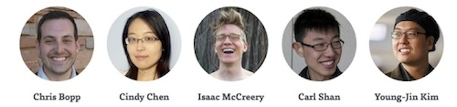

Predicting Social Service Outcomes
===========


*“It is health that is real wealth and not pieces of gold and silver.”*
-- Mahatma Gandhi

### Background
-----
There are a large number of patients who go to hospitals or clinics with health concerns that are actually brought on by socioeconomic factors. An athsmatic condition, for example, can be significantly worsened by a dusty and moldy home. Yet many patients may lack the means to move into better environments.

[Health Leads](healthleadsusa.org) is a national non profit organization that trains college students, dubbed Health Leads Advocates, to work with clients who need basic resources such as food, transportation or housing. These college students learn about each patient’s needs, and meticulously dig up resource providers -- food banks, employment opportunities, childcare services -- that can fulfill these needs. 

In the nearly two decades since Health Leads’ inception, its impact on the health landscape has been tremendous. In 2013 alone, Health Leads Advocates worked with over 11,000 patients to connect them with basic services and resources.

#### The Problem
Nevertheless, despite Health Leads’ remarkable success, it faces a worrying hurdle: a large proportion of their clients would disconnect from working with Health Leads. These clients would be unreachable, not returning phone calls and ultimately Advocates would be forced to close their cases -- never knowing if these clients received the basic resources they needed. 

Health Leads came to our team in DSSG to help use data to discover the underlying factors that predict whether a patient is likely to disconnect from Health Leads' program or not.


#### The Data

The data was provided to us by Health Leads, and is not publicly available. If you are interested in working on this project, and would like to examine the data, please get in touch at [dssg-healthleads@googlegroups.com](dssg-healthleads@googlegroups.com).

#### The Models
----
Our team built a number of classifiers to predict whether a patient will disconnect from Health Leads. We modeled disconnection using a logistic regression as well as a random forest, using the following features:

- **Responsiveness**: \# of times a client was contacted in the first 30 days of interaction
- **Responsiveness**: \# of times a client was unable to be reached in the first 30 days of interaction
- **Need Complexity**: Computed probability of all of a client's needs being disconnected
- **Need Complexity**: The sum of the median number of days each of a client's need has historically taken to be resolved
- **Demographics**: Client age at time of program enrollment


Some findings from our data that we discovered:

- **Need Complexity**: The need complexity of all of a client's needs being disconnected is a helpful early proxy for the likelihood of disconnection
- **Responsiveness**: The # of times a client is successfully contacted has a larger impact on a client disconnecting than the # of times a client fails to pick up their phone.


### Project Layout
-----
- `/prepare_data/`
	- `clean.py` contains functions for cleaning and transforming the data
	- `load.py` is a sub-module that loads all of the data, which can then be imported into other scripts e.g., 
	```python 
		from prepare_data.load import cleaned_data
	```
	- `utils.py` contains simple utility functions
- `/models/` 
	- `pipeline.py` contains functions to set up a testing and training set, adding features and running the Random Forest & Logistic Regression models
	- `features.py` contains many helper functions called in `pipeline.py` that constructs features
	- `visualization.py` contains functions for plotting ROC, recall-specificity curves as well as feature-importance rankings
	- `diagnostics.py` contains a function that returns several metrics about the performance of a particular model
- `/ipython_notebooks/`
	- TODO

### Installation Guide
-----
```unix git clone [TODO: REPO NAME]```

```cd healthleads```

``` ipython notebook --pylab=inline```

Open the Modeling iPython Notebook to see a sample of how we modeled the data.
### Team
-----



### Contributing to the Project
-----

To get involved, please check the issue tracker. Issues include everything from bugs to new project ideas that we'd like to see happen!

To get in touch, email the team at [dssg-healthleads@googlegroups.com](dssg-healthleads@googlegroups.com) or file a Github issue.


### License
-----
The MIT License (MIT)

Copyright (c) 2014 Data Science for Social Good, Carl Shan, Cindy Chen, Chris Bopp, Issac McCreery

Permission is hereby granted, free of charge, to any person obtaining a copy
of this software and associated documentation files (the "Software"), to deal
in the Software without restriction, including without limitation the rights
to use, copy, modify, merge, publish, distribute, sublicense, and/or sell
copies of the Software, and to permit persons to whom the Software is
furnished to do so, subject to the following conditions:

The above copyright notice and this permission notice shall be included in all
copies or substantial portions of the Software.

THE SOFTWARE IS PROVIDED "AS IS", WITHOUT WARRANTY OF ANY KIND, EXPRESS OR
IMPLIED, INCLUDING BUT NOT LIMITED TO THE WARRANTIES OF MERCHANTABILITY,
FITNESS FOR A PARTICULAR PURPOSE AND NONINFRINGEMENT. IN NO EVENT SHALL THE
AUTHORS OR COPYRIGHT HOLDERS BE LIABLE FOR ANY CLAIM, DAMAGES OR OTHER
LIABILITY, WHETHER IN AN ACTION OF CONTRACT, TORT OR OTHERWISE, ARISING FROM,
OUT OF OR IN CONNECTION WITH THE SOFTWARE OR THE USE OR OTHER DEALINGS IN THE
SOFTWARE.
